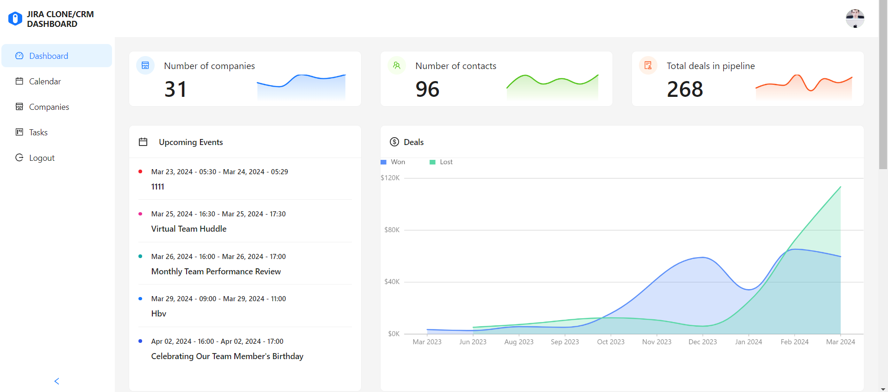
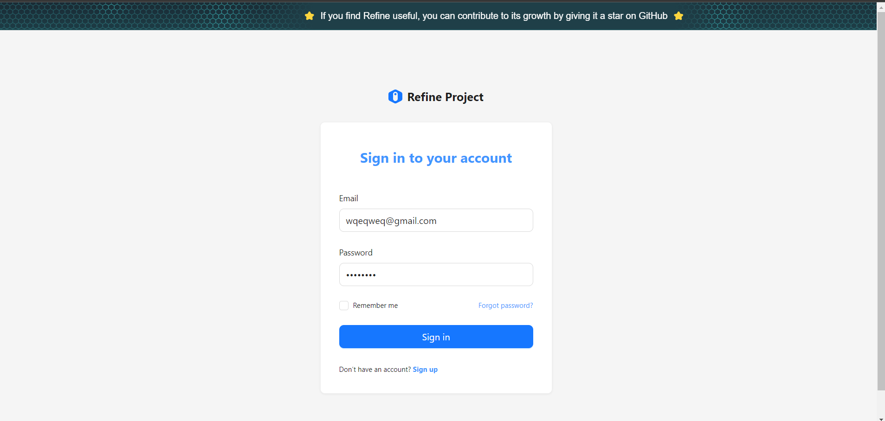
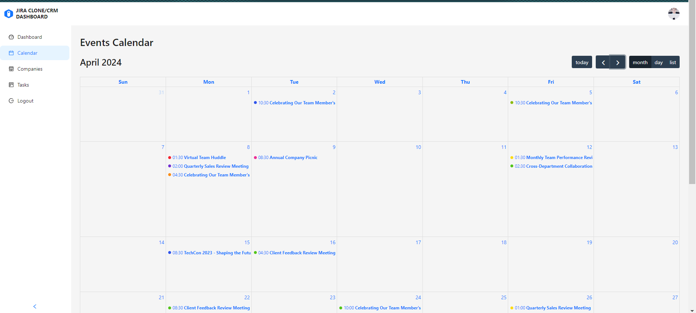
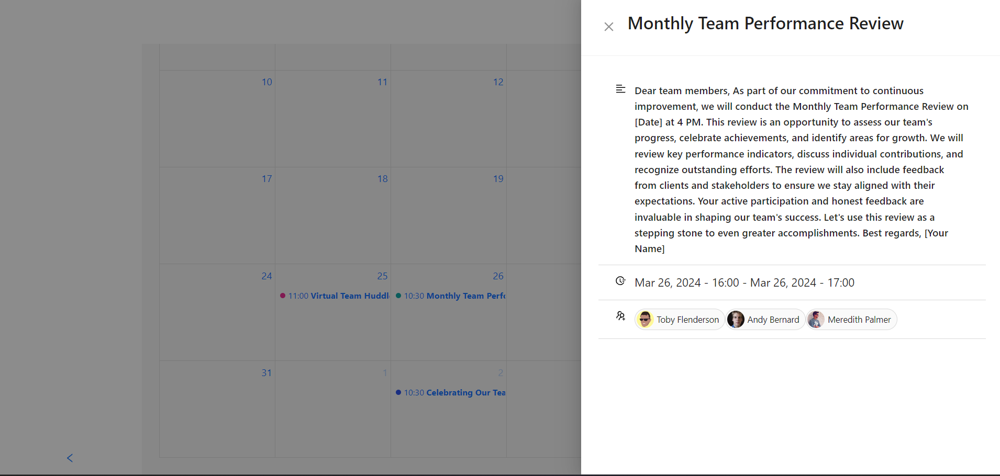
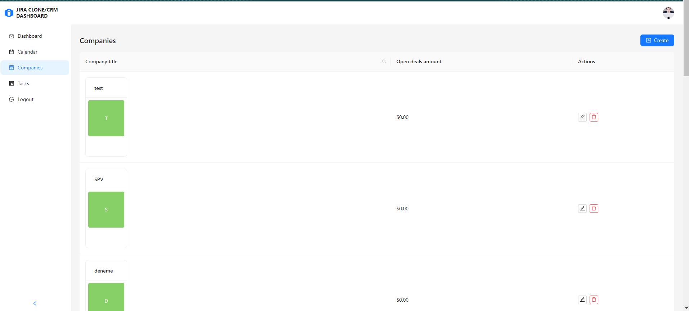
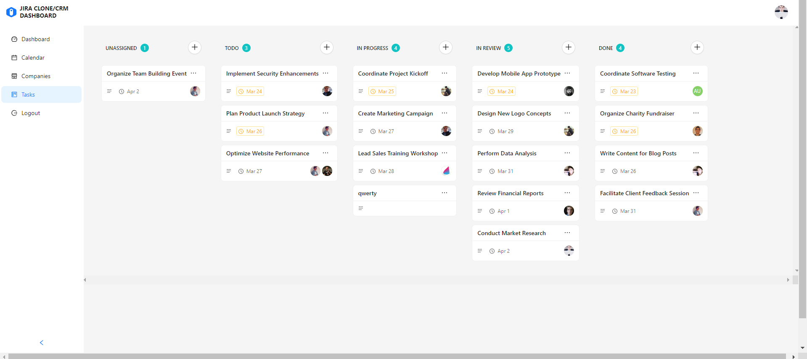

# JIRA Clone/ CRM Dashboard

Web application that helps the user visualize and manage the whole sales pipeline along with tasks and an event manager. Made with refine. dev framework along with graphql for the backend.


## Demo

https://crm-dash-board-akshat-sharma.vercel.app/

## How it works/ Documentation:


## Features
Dashboard: Gain insights into your business with interactive charts and analytics.

Calendar: Schedule and manage appointments, meetings, and events.

Tasks: Organize and track tasks using a Kanban-style board.

Companies: Create, update, and delete company records and monitor deals with those companies.

Contacts: Manage your customer contacts efficiently.

Calendar: Manage and visualize all the events in the month in the form of a chart or a list


## Screenshots


<br>


<h3>DashBoard</h3>
<br/>

<h3>Login</h3>
<br/>

<h3>Calendar</h3>
<br/>

<h3>Calendar Events</h3>
<br/>

<h3>Comapany Page</h3>
<br/>

<h3>Tasks</h3>
<br/>


<br>

## Tech Stack

**Client:** React, Redux, Ant Design

**Server:** Node.js, GraphQL


## Running Tests

To run tests, run the following command

```bash
  npm run test
```


## Available Scripts

### Running the development server.

```bash
    npm run dev
```

### Building for production.

```bash
    npm run build
```

### Running the production server.

```bash
    npm run start
```

## Learn More

To learn more about **Refine**, please check out the [Documentation](https://refine.dev/docs)

- **GraphQL Data Provider** [Docs](https://refine.dev/docs/core/providers/data-provider/#overview)
- **Ant Design** [Docs](https://refine.dev/docs/ui-frameworks/antd/tutorial/)
- **React Router** [Docs](https://refine.dev/docs/core/providers/router-provider/)
- **Custom Auth Provider** [Docs](https://refine.dev/docs/core/providers/auth-provider/)

## License

MIT
